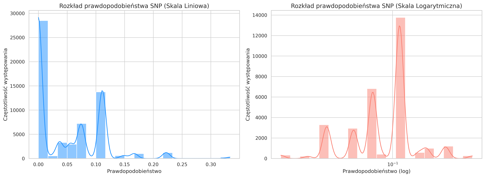
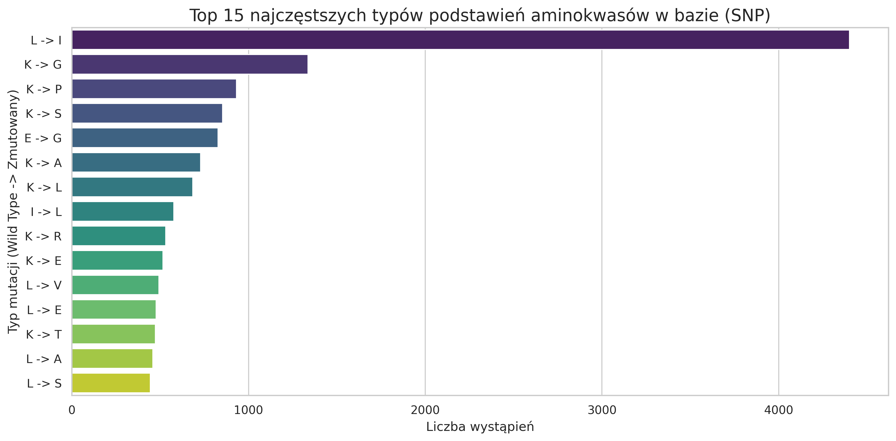
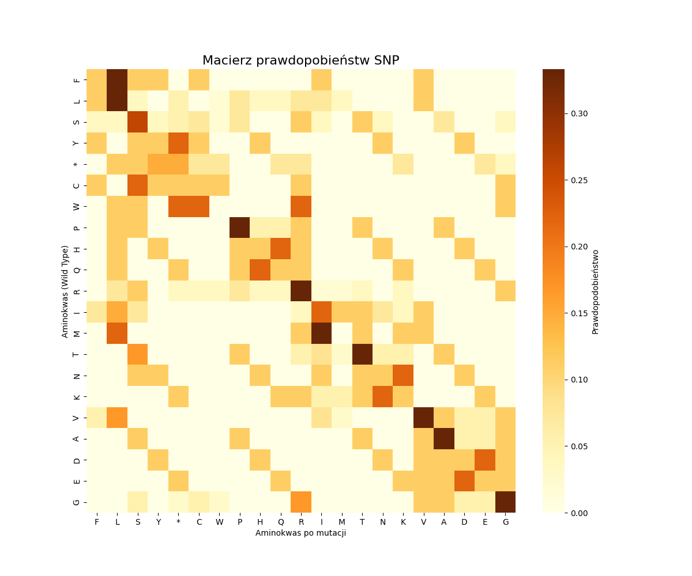

# Ocena prawdopodobieństwa występowania wariantów sekwencji białkowych (BWT)

Projekt realizowany w celu weryfikacji i oceny wiarygodności wariantów sekwencji białkowych zidentyfikowanych przy pomocy Transformacji Burrowsa-Wheelera (BWT) w danych proteomicznych.

## Kontekst naukowy i problem badawczy
Obecne standardowe metody analizy danych proteomicznych z pomiarów spektrometrii mas pozwalają głównie na identyfikację tzw. kanonicznych sekwencji aminokwasowych. Powoduje to utratę cennych informacji o różnorodności populacyjnej, ponieważ proteom jest traktowany jako zamknięty zbiór, nieoddający różnic między osobnikami tego samego gatunku.

W **Pracowni Struktury Biopolimerów MWB** opracowano bazę danych [AliceDB](http://alicedb.ug.edu.pl/) oraz narzędzia bioinformatyczne pozwalające na identyfikację sekwencji unikalnych dla danego osobnika. Zastosowanie **Transformacji Burrowsa-Wheelera (BWT)** umożliwiło poszukiwanie wariantów jeszcze nieopisanych w literaturze. 

**Główny problem:** Zastosowanie BWT wiąże się ze znacznym prawdopodobieństwem otrzymania fałszywie pozytywnych identyfikacji. 

**Cel projektu:** Opracowanie metody odfiltrowania wyników fałszywie pozytywnych i ocena ich wiarygodności na podstawie prostych reguł funkcjonowania kodu genetycznego i prawdopodobieństwa wystąpienia danej mutacji.

### `V2/` (Wersja aktualna - Rekomendowana)
Zawiera zaktualizowany skrypt analityczny z modułem generowania zaawansowanych statystyk i wykresów.
* `validate_2.0.py` – Główny skrypt weryfikujący. Przetwarza duże pliki wynikowe z AliceDB (tryb *chunking*), dopisuje prawdopodobieństwa do mutacji i generuje wizualizacje.
* `results_histogramy.png` / `results_top_mutacje.png` / `results_matrix_heatmap.png` – Wygenerowane wykresy z wynikami z bazy.

### `V1/` (Wersja pierwotna)
Zawiera historyczne wersje skryptów oraz macierz bazową:
* `macierz_mutacji.csv` – Autorska macierz prawdopodobieństw podstawień aminokwasów, wskazująca szanse na konkretną mutację na podstawie kodu genetycznego.
* `validate_ver_1.0.py` – Pierwotna wersja walidatora (bez modułu graficznego).
* Skrypty pomocnicze (`mutation_matrix_1.py`, `mutation_matrix_3.py`).

## Wizualizacja wyników (V2)

Zastosowanie wersji 2.0 pozwala na szybką ocenę biologiczną i statystyczną wygenerowanych wyników.

### Wizualizacja i Statystyki
Nowa wersja skryptu automatycznie generuje wykresy analityczne:
* **Rozkład prawdopodobieństw (Histogramy)**: 

Zestawienie skali liniowej i logarytmicznej. Skala logarytmiczna pozwala na dokładną analizę rzadkich, ale biologicznie dopuszczalnych wariantów.
* **Analiza najczęstszych podstawień**: 

Wykres słupkowy prezentujący 15 najczęściej występujących typów mutacji (np. L -> I) w badanym zbiorze danych, co pozwala na szybką ocenę trendów biologicznych w bazie.
* **Macierz Prawdopodobieństw mutacji SNP**


## Uruchomienie
Aby uruchomić aplikację, należy przejść do folderu z odpowiednią wersją i wywołać skrypt podając plik z danymi (`.tsv`)
```bash
cd V2
python3 validate_2.0.py -f path/to/file.tsv --save_fig --show_fig
```

## Pliki Wyjściowe
* `_all.tsv` - Pełna baza z przypisanymi prawdopodobieństwami
* `_possible.tsv` - Warianty odfiltrowane (tylko te, gdzie prawdopodobieństwo > 0)
* Pliki graficzne `.png` (jeśli użyto flagi `--save_fig`)
  
### Wymagania
* Python 3.x
* Biblioteki: `pandas`, `matplotlib`, `seaborn`, `tqdm`

Instalacja wymaganych pakietów:
```bash
pip install -r requirements.txt
